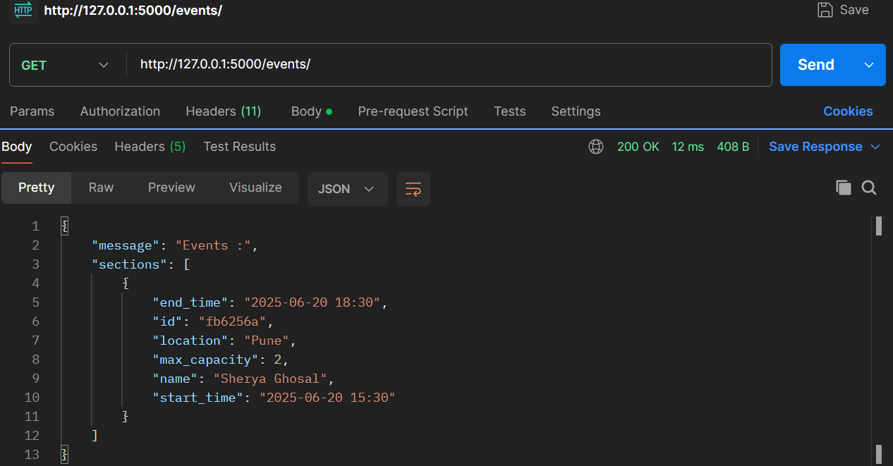

# 🎉 Event Management API
A Flask-based RESTful API for managing events and attendees. This system allows users to create events, register attendees, and retrieve event and attendee information.

## ⚙️Features
- Timezone conversion (IST ↔ UTC)
- Pagination for attendee lists
- Duplicate attendee prevention
- Capacity enforcement
- Uses RAW SQLite for database storage.

---

## 📁 Project Structure
```
Omnify_MEMS_API/
├── app.py
├── requirements.txt
├── README.md
├── blueprints/
│   ├── __init__.py
│   ├── create_event.py
│   ├── get_event.py
│   ├── register_attendee.py
│   └── get_attendee.py
├── services/
│   ├── __init__.py
│   └── event_service.py
├── models/
│   ├── __init__.py
│   ├── db_connection.py
│   ├── schema.sql
│   └── MEMS.db
├── utils/
│   ├── __init__.py
│   └── timezone.py
├── tests/
│   ├── __init__.py
│   └── test_api.py
└── .pytest_cache/
```

---
## 🚀 Getting Started
### Prerequisites
- Python 3.8+
- Flask
- pytest
- SQLite (or your preferred DB)

## Installation & Setup
### Prerequisites
- Python 3.7+
- `pip` (Python package manager)

### Steps
1. Clone the repository:
   ```sh
   git clone `https://github.com/Rohit-Sandanshiv/Event_management_API.git`
   cd Omnify_MEMS_API
   ```
2. Create and activate a virtual environment:
   ```sh
   python -m venv venv
   source venv/bin/activate  # On Mac/Linux
   venv\Scripts\activate  # On Windows
   ```
3. Install dependencies:
   ```sh
   pip install -r requirements.txt
   ```
4. Run the Flask app:
   ```sh
   python app.py
   ```
   The API will be available at `http://127.0.0.1:5000/`

---

## API Endpoints
### 1. Create Event
**Endpoint:** `POST http://127.0.0.1:5000/events/`

**Payload:**
```json
{
    "payload": {
        "name": "Arjit Singh",
        "location": "Pune",
        "start_time": "2025-06-20 15:30",
        "end_time": "2025-06-20 18:30",
        "max_capacity": 1
    }
}
```
**Response:**
```json
{
  "message": "Event Created",
  "event": "event_id"
}
```
CURL Command (Windows CMD)
curl -v -H "Content-Type: application/json" -H "TransactionId: transaction_1" -H "ISOCountry: INDIA" --request POST --data "{ \"payload\": {\"name\":\"Shreya Ghosal\", \"location\": \"Pune\", \"start_time\": \"2025-06-20 15:30\", \"end_time\": \"2025-06-20 18:30\", \"max_capacity\":2}}" http://127.0.0.1:5000/events/

### 2. Retrieve Events list
**Endpoint:** `GET http://127.0.0.1:5000/events/`

**Response:**
```json
{
  "message": "Events :",
  "sections": [
    {
      "end_time": "2025-06-20 18:30",
      "id": "19f51d4",
      "location": "Pune",
      "max_capacity": 2,
      "name": "Sherya Ghosal",
      "start_time": "2025-06-20 15:30"
    }
  ]
}
```
CURL Command (Windows CMD):
curl -v -H "Content-Type: application/json" -H "TransactionId: transaction_1" -H "ISOCountry: INDIA" --request GET http://127.0.0.1:5000/events/


### 3. Register Attendees
**Endpoint:** `POST http://127.0.0.1:5000/events/5cc3c4a/register`

**Payload:**
```json
{
    "payload": {
        "name": "Rohit Sandanshiv",
        "email": "rssandanshiv782000@gmail.com"
    }
}
```
**Response:**
```json
{
  "message": "Insert Successful...",
  "status": "success"
}
```
CURL Command (Windows CMD):
curl -v -H "Content-Type: application/json" -H "TransactionId: transation_1" -H "ISOCountry: INDIA" --request POST --data "{ \"payload\": {\"name\":\"Rohit Sandanshiv\", \"email\": \"rssandanshiv782000@gmail.com\"}}" http://127.0.0.1:5000/events/19f51d4/register


### 4. Retrieve attendees list
**Endpoint:** `GET http://127.0.0.1:5000/events/19f51d4/attendee`

**Response:**
```json
{
  "message": "Attendees :",
  "sections": [
    {
      "email": "rssandanshiv782000@gmail.com",
      "event_id": "19f51d4",
      "id": "f74353b",
      "name": "Rohit Sandanshiv"
    }
  ]
}
```
CURL Command (Windows CMD):
curl -v -H "Content-Type: application/json" -H "TransactionId: transation_1" -H "ISOCountry: INDIA" --request GET http://127.0.0.1:5000/events/19f51d4/attendee

---

## Tests include:

- Event creation
- Event retrieval
- Attendee registration
- Attendees listing
- Duplicate registration handling
- Full capacity handling
- 
### run test suite using
`pytest -v`


### API Responses in postman
- 
- 
- 
- 
- 
- 
- 

## Future Scope & Improvements
1. **Enhance Security:**
   - Implement authentication and authorization (e.g., JWT-based login).
   - Add rate limiting and input sanitization to prevent abuse and injection attacks.
     Database Optimization & Scalability

2. **Database Optimization:**
   - While this project uses raw SQL with SQLite for simplicity and ease of setup, it is structured in a modular way 
     using Blueprints and utility functions. This makes it easy to migrate to a more scalable solution like PostgreSQL or MySQL.
   - Refactor to use an ORM like SQLAlchemy for better maintainability, relationships, and migrations..
   - Add indexing to improve query performance.

3. **Logging & Monitoring:**
   - Integrate structured logging and error tracking (e.g., with Sentry).
   - Add monitoring dashboards using Prometheus and Grafana.

4. **Timezone-Aware Scheduling**
   - Currently, events are stored in UTC and converted to the user's timezone on request.
   - Future enhancements could include user-specific timezone preferences and calendar integrations.


5. **Testing & CI/CD**
   - Expand test coverage with edge cases and integration tests.
   - Set up automated testing and deployment pipelines using GitHub Actions or similar tools

6. **Advanced Features**
   - Add filtering and sorting options for events and attendees.
   - Implement search functionality (e.g., by event name or location).
   - Add support for recurring events or multi-day events.

---
## Bonus
   - To overcome this limitation, Same project with SQLAlchemy support and flasgger documentation is created, please do checkout
   - https://github.com/Rohit-Sandanshiv/EVENT_MANAGEMENT_API_SQLAlchemy.git

## Contribution
Feel free to contribute by submitting issues or pull requests.

---

## Author
**Rohit Sandanshiv**

---

## License
MIT License
